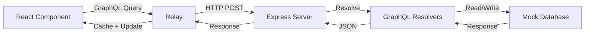

<div align="center">

# 💸 Relay Flow

### Gerenciador Financeiro Moderno com GraphQL & Relay

[](https://nodejs.org/)
[](https://reactjs.org/)
[](https://graphql.org/)
[](https://relay.dev/)

[Funcionalidades](#-funcionalidades) • [Tecnologias](#-stack-tecnológica) • [Instalação](#-instalação) • [Arquitetura](#-arquitetura) • [Documentação](#-documentação)

</div>

---

## 📖 Sobre o Projeto

**Relay Flow** é uma aplicação full-stack de gerenciamento financeiro que demonstra a implementação profissional do padrão **Data Colocation** utilizando **GraphQL** e **Relay**. 

O projeto foi construído com foco em:
- ✨ **Performance otimizada** através de cache inteligente
- 🎯 **Tipagem forte** e segurança de dados
- 🔄 **Atualizações otimistas** para melhor UX
- 📦 **Modularização** com componentes colocalizados
- 🛡️ **Validações robustas** em backend e frontend

> **Objetivo:** Eliminar over-fetching e under-fetching, garantindo que cada componente declare explicitamente suas necessidades de dados.

---

## ✨ Funcionalidades

### 👤 Gerenciamento de Usuários
- ✅ Listagem de usuários
- ✅ Criação de novos usuários com validação de email
- ✅ Edição de perfil (nome e email)
- ✅ Exclusão de usuários

### 💰 Gerenciamento de Transações
- ✅ Visualização de transações por usuário
- ✅ Criação de transações com validação de valores
- ✅ Edição inline de transações
- ✅ Exclusão com confirmação
- ✅ Formatação automática de valores monetários

### 🎨 Interface Moderna
- ✅ Design responsivo e intuitivo
- ✅ Notificações toast para feedback
- ✅ Modals para edição
- ✅ Loading states gerenciados pelo Relay
- ✅ Header fixo com logo personalizado

---

## 🚀 Stack Tecnológica

### Backend
```
Node.js + Express + GraphQL
```
| Tecnologia | Versão | Propósito |
|------------|--------|-----------|
| **Node.js** | 14+ | Runtime JavaScript |
| **Express** | ^4.19.2 | Framework web |
| **express-graphql** | ^0.12.1 | Middleware GraphQL |
| **GraphQL** | ^15.8.0 | Linguagem de query |
| **CORS** | ^2.8.5 | Política de segurança |

### Frontend
```
React + Relay + Modern Build Tools
```
| Tecnologia | Versão | Propósito |
|------------|--------|-----------|
| **React** | ^19.2.0 | Biblioteca UI |
| **Relay** | ^20.1.1 | Cliente GraphQL |
| **CRACO** | ^7.1.0 | Configuração CRA customizada |
| **Babel Relay Plugin** | ^20.1.1 | Compilação de queries |

### Ferramentas de Desenvolvimento
- **Jest** - Testes unitários
- **Relay Compiler** - Geração de tipos e otimização de queries
- **get-graphql-schema** - Introspection do schema

---

## 📦 Instalação

### Pré-requisitos

```bash
Node.js >= 14.0.0
npm >= 6.0.0
```

### 1️⃣ Clone o Repositório

```bash
git clone https://github.com/alessandrolsdev/gerenciador-transacional-simples.git
cd gerenciador-transacional-simples
```

### 2️⃣ Configuração do Backend

```bash
# Instalar dependências
npm install

# Iniciar servidor GraphQL
npm start
```

✅ Servidor disponível em: **http://localhost:4000/graphql**

### 3️⃣ Configuração do Frontend

```bash
# Navegar para o diretório do cliente
cd frontend/client

# Instalar dependências
npm install

# Atualizar schema GraphQL
npm run update-schema

# Compilar artefatos do Relay
npm run relay

# Iniciar aplicação React
npm start
```

✅ Aplicação disponível em: **http://localhost:3000**

---

## 📂 Estrutura do Projeto

```
relay-flow/
├── 📁 frontend/client/          # Aplicação React
│   ├── 📁 public/               # Assets estáticos
│   │   ├── favicon.svg          # Favicon customizado
│   │   └── index.html           # Template HTML
│   ├── 📁 src/
│   │   ├── 📁 components/       # Componentes React
│   │   │   ├── EditUserForm.js
│   │   │   └── TransactionListItem.js
│   │   ├── 📁 __generated__/    # Artefatos do Relay (auto-gerados)
│   │   ├── App.js               # Componente principal
│   │   ├── App.css              # Estilos da aplicação
│   │   ├── index.js             # Entry point
│   │   ├── RelayEnvironment.js  # Configuração do Relay
│   │   └── reportWebVitals.js
│   ├── 📁 data/
│   │   └── schema.graphql       # Schema GraphQL (gerado)
│   ├── craco.config.js          # Configuração CRACO
│   ├── relay.config.json        # Configuração Relay Compiler
│   └── package.json
│
├── 📁 node_modules/
├── mockDb.js                    # Banco de dados simulado
├── resolvers.js                 # Resolvers GraphQL
├── schema.js                    # Definição do schema
├── server.js                    # Servidor Express
├── resolvers.test.js            # Testes unitários
├── package.json
└── README.md
```

---

## 🏗️ Arquitetura

### Fluxo de Dados



### Schema GraphQL

```graphql
type User {
  id: ID!
  name: String!
  email: String!
}

type Transaction {
  id: ID!
  amount: Float!
  userId: ID!
  description: String!
}

type Query {
  user(id: ID!): User
  transactions(userId: ID!): [Transaction]
}

type Mutation {
  createUser(name: String!, email: String!): User!
  createTransaction(amount: Float!, userId: ID!, description: String!): Transaction!
  updateUser(id: ID!, name: String, email: String): User!
  updateTransaction(id: ID!, amount: Float, description: String): Transaction!
  deleteUser(id: ID!): User
  deleteTransaction(id: ID!): Transaction
}
```

### Validações Implementadas

#### Backend
- ✅ Validação de formato de email (Regex)
- ✅ Verificação de campos obrigatórios
- ✅ Validação de valores negativos
- ✅ Geração única de IDs (previne duplicatas)
- ✅ Tratamento de erros descritivos

#### Frontend
- ✅ Validação de valores numéricos
- ✅ Verificação de tamanho mínimo (nome, descrição)
- ✅ Limites de caracteres (`maxLength`)
- ✅ Feedback visual de erros
- ✅ Confirmação antes de exclusões

---

## 🧪 Testes

### Executar Testes do Backend

```bash
npm test
```

### Cobertura de Testes
- ✅ CRUD de usuários
- ✅ Validações de entrada
- ✅ Tratamento de erros

---

## 📜 Scripts Disponíveis

### Backend
| Script | Comando | Descrição |
|--------|---------|-----------|
| start | `npm start` | Inicia o servidor GraphQL |
| test | `npm test` | Executa testes com Jest |

### Frontend
| Script | Comando | Descrição |
|--------|---------|-----------|
| start | `npm start` | Inicia aplicação React |
| build | `npm run build` | Build de produção |
| test | `npm test` | Executa testes |
| relay | `npm run relay` | Compila queries Relay |
| update-schema | `npm run update-schema` | Baixa schema do backend |

---

## 🎯 Decisões Técnicas

### Por que Relay?

1. **Cache Automático**: Gerenciamento inteligente de estado sem Redux
2. **Colocation**: Queries definidas junto aos componentes
3. **Otimização**: Batching automático de requisições
4. **Tipagem**: Geração automática de tipos TypeScript-like
5. **Atualizações Otimistas**: UX fluída sem espera

### Por que GraphQL?

1. **Precisão**: Busca apenas os dados necessários
2. **Versionamento**: Sem necessidade de versionar a API
3. **Introspection**: Documentação automática
4. **Forte Tipagem**: Validação em tempo de desenvolvimento
5. **Mutations**: Operações complexas simplificadas

### Por que CRACO?

O Create React App não permite customização do Babel sem ejetar. O **CRACO** permite:
- ✅ Adicionar `babel-plugin-relay`
- ✅ Manter atualizações do CRA
- ✅ Configuração limpa e manutenível

---

## 🔒 Segurança

- ✅ CORS configurado com origem específica
- ✅ Validação de entrada em todas as mutations
- ✅ Sanitização de dados
- ✅ Proteção contra IDs duplicados
- ✅ Tratamento de erros sem expor stack traces

---

## 📚 Documentação

Todo o código está documentado seguindo padrões profissionais:

- **JSDoc** completo em todos os arquivos JavaScript
- **Comentários descritivos** em CSS
- **Documentação inline** de lógicas complexas
- **100% em Português Brasileiro**
- **Padrão sênior** com tom formal

### Exemplos de Documentação

```javascript
/**
 * Cria um novo usuário.
 * @param {Object} args - Os argumentos passados para a mutation.
 * @param {string} args.name - O nome do novo usuário.
 * @param {string} args.email - O email do novo usuário.
 * @throws {Error} Se o nome ou email estiverem faltando ou se o email for inválido.
 * @returns {Object} O objeto do usuário recém-criado.
 */
createUser: (args) => {
  // Implementação...
}
```

---

## 🚀 Deploy

### Backend

```bash
# Produção requer configuração de variáveis de ambiente
FRONTEND_URL=https://seu-dominio.com npm start
```

### Frontend

```bash
# Build otimizado
npm run build

# Deploy em serviços como Vercel, Netlify, etc.
```

---

## 🤝 Contribuindo

Contribuições são bem-vindas! Para contribuir:

1. Fork o projeto
2. Crie uma branch para sua feature (`git checkout -b feature/MinhaFeature`)
3. Commit suas mudanças (`git commit -m 'Add: MinhaFeature'`)
4. Push para a branch (`git push origin feature/MinhaFeature`)
5. Abra um Pull Request

---

## 📄 Licença

Este projeto está sob a licença **ISC**.

---

## 👨‍💻 Autor

**Alessandro** - Desenvolvedor Full Stack

[](https://github.com/alessandrolsdev)

---

## 🙏 Agradecimentos

- [Relay Team](https://relay.dev/) pela documentação excepcional
- [GraphQL Foundation](https://graphql.org/) pelo padrão
- Comunidade React pela inspiração

---

<div align="center">

**⭐ Se este projeto foi útil, considere dar uma estrela!**

Made with ❤️ and ☕

</div>